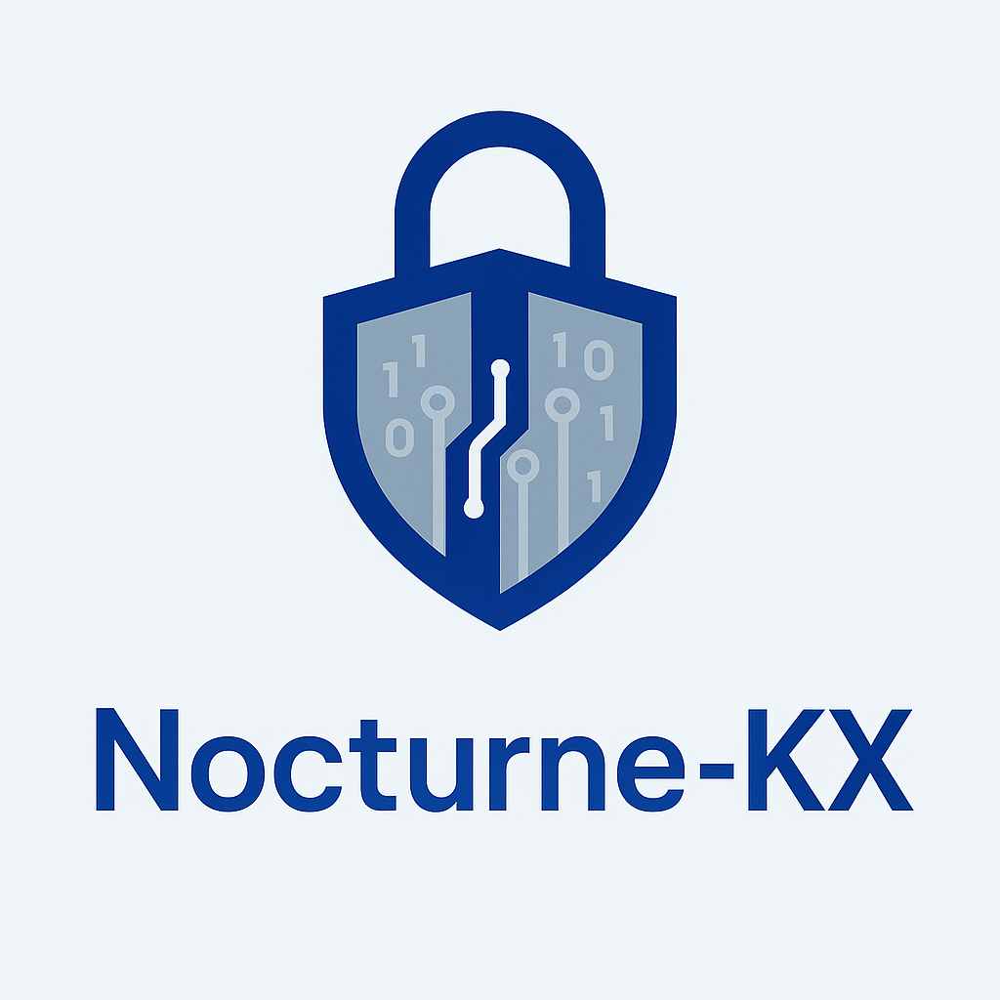

# Nocturne-KX

<div align="center">
  
  
  <strong>Modern end-to-end cryptographic communication toolkit (C++23, libsodium)</strong>
  
  <br/>
  
  
  
  
</div>

---

## Overview

Nocturne-KX is a compact, security-focused framework for building secure messaging and communication systems. It combines authenticated key exchange, forward secrecy, and a production-leaning Double Ratchet core with practical operational features such as replay protection, rate limiting, audit logging, and optional HSM-backed key storage.

Key design goals:
- Clear security boundaries and conservative defaults
- Strict use of modern primitives from libsodium
- Practical CLI demos and transparent, documented behavior

---

## Features

### Core cryptography
- X25519 ECDH for key agreement
- XChaCha20-Poly1305 AEAD for authenticated encryption
- Ed25519 for identity signatures
- BLAKE2b for transcript hashing
- Argon2/crypto_pwhash for passphrase-based key protection

### Protocol capabilities
- Authenticated SIGMA-style handshake with transcript binding
- Double Ratchet core: DH ratchet, send/receive chains, skipped key storage, out-of-order handling, state serialization
- Transport layer: NEGOTIATE/DATA/ACK/NAK/CLOSE frames, sequence numbers, retry queues, feature negotiation (in-memory adapter included)

### Operational security
- ReplayDB with composite keys (receiver/sender/session) and encrypted metadata
- Token-bucket rate limiter with persistence (JSONL) and backoff
- Structured audit logging (JSON Lines) with atomic writes
- FileHSM with passphrase-encrypted secret keys; PKCS#11 wrapper stub for real HSMs

### Side-channel and memory safety
- Constant-time comparisons (`sodium_memcmp`) and secure zeroing (`sodium_memzero`)
- SecureAllocator with memory locking, guard pages, and scrubbing
- Branchless constant-time helpers; optional random delay (configurable/disableable)

---

## Architecture (high level)

```
Application
  │
  ├─ Handshake (SIGMA-style, Ed25519 identities, X25519 ephemeral)
  │     └─ Transcript hashing, two-way KDF
  │
  ├─ Double Ratchet (DH ratchet, chains, skipped keys)
  │
  └─ Transport (negotiate, seq/ACK/NAK, retry) ── In-memory adapter
        │
        ├─ ReplayDB (encrypted metadata)
        ├─ RateLimiter (persistent)
        ├─ AuditLog (JSONL, atomic)
        └─ HSM Interface (FileHSM, PKCS#11 stub)
```

---

## Quick start

### Prerequisites
- C++23 compiler (GCC 12+, Clang 15+, MSVC 2022)
- CMake 3.20+
- libsodium 1.0.18+
- Catch2 3.x (for tests)

### Build
```bash
# Clone
git clone https://github.com/your-repo/Nocturne-KX.git
cd Nocturne-KX

# Configure & build
mkdir build && cd build
cmake .. -DCMAKE_BUILD_TYPE=Release
cmake --build . -j

# (optional) Run tests if built
ctest --output-on-failure
```

### Platform notes
- Ubuntu/Debian: `sudo apt-get install -y libsodium-dev pkg-config cmake build-essential`
- macOS: `brew install libsodium pkg-config cmake`
- Windows (vcpkg): install libsodium via `vcpkg install libsodium:x64-windows` and pass `-DCMAKE_TOOLCHAIN_FILE=.../vcpkg.cmake`

---

## Usage

### Key management
```bash
# Generate receiver key pair
./nocturne-kx gen-receiver keys/

# Generate signer key pair
./nocturne-kx gen-signer keys/

# Generate signer key with passphrase-encrypted storage
./nocturne-kx gen-signer keys/ --hsm-pass "your-secure-passphrase"
```

### Handshake demo
```bash
./nocturne-kx hs-demo
# Demonstrates: authenticated handshake, identity signatures, transcript hashing, key derivation
```

### Double Ratchet demo
```bash
./nocturne-kx dr-demo
# Demonstrates: DH ratchet, message keys, out-of-order handling, state serialization
```

### Encrypt / Decrypt
```bash
# Encrypt
./nocturne-kx encrypt \
  --rx-pk keys/receiver_x25519_pk.bin \
  --in message.txt \
  --out encrypted.bin

# Decrypt with replay protection
./nocturne-kx decrypt \
  --rx-pk keys/receiver_x25519_pk.bin \
  --rx-sk keys/receiver_x25519_sk.bin \
  --replay-db /path/to/replay.db \
  --mac-key /path/to/mac.key \
  --in encrypted.bin \
  --out decrypted.txt
```

### Signatures, rate limiting, audit
```bash
# Encrypt with Ed25519 signature (FileHSM URI)
./nocturne-kx encrypt \
  --rx-pk keys/receiver_x25519_pk.bin \
  --sign-hsm-uri file://keys/sender_ed25519_sk.bin \
  --in message.txt \
  --out encrypted_signed.bin

# Configure rate limiting persistence
./nocturne-kx encrypt \
  --rx-pk keys/receiver_x25519_pk.bin \
  --rate-limit-store /path/to/rate_limits.jsonl \
  --in message.txt \
  --out encrypted.bin

# Enable structured audit logging
./nocturne-kx encrypt \
  --rx-pk keys/receiver_x25519_pk.bin \
  --audit-log /path/to/audit.log \
  --in message.txt \
  --out encrypted.bin
```

### Global CLI flags
- `--rate-limit-store <path>`: Persist token-bucket state
- `--audit-log <path>`: JSONL audit log path
- `--hsm-pass <passphrase>`: Passphrase for FileHSM-encrypted keys

---

## Documentation
- Security Guide: `docs/SECURITY.md`
- Operations Guide: `docs/OPERATIONS.md`

---

## Status & roadmap

### Current status
- Alpha/prototype; suitable for research, demos, and experimentation
- Not production-hardened; subject to change

### Roadmap
- Noise/X3DH integration and complete Double Ratchet compatibility
- Real transport adapters (TCP/QUIC) and interop testing
- Production PKCS#11 HSM integration
- Metrics/observability and enhanced operational tooling

---

## Security notice
This software is provided as an alpha/prototype. It has not undergone formal security review. Do not deploy in production without a comprehensive security audit, penetration testing, and appropriate compliance processes. FileHSM is for development; use real HSMs for production key storage.

---

## License
MIT License — see `LICENSE`.

---

## Contact
- Security issues: serdarogluibrahim@gmail.com
- General questions: open a GitHub issue/discussion in this repository

## Audit logging (signed, chained) and ReplayDB counter

```bash
# Enable audit log with Ed25519 signing and WORM output
./nocturne-kx encrypt \
  --rx-pk keys/receiver_x25519_pk.bin \
  --audit-log logs/audit.jsonl \
  --audit-sign-key keys/audit_ed25519_sk.bin \
  --audit-worm-dir logs/worm \
  --in message.txt \
  --out encrypted.bin

# Optionally include an external time anchor (e.g., RFC3161 TSA token blob)
./nocturne-kx encrypt \
  --rx-pk keys/receiver_x25519_pk.bin \
  --audit-log logs/audit.jsonl \
  --audit-sign-key keys/audit_ed25519_sk.bin \
  --audit-anchor anchors/tsa_token.bin \
  --in message.txt \
  --out encrypted.bin

# Use ReplayDB with external monotonic counter to detect rollback
./nocturne-kx encrypt \
  --rx-pk keys/receiver_x25519_pk.bin \
  --replay-db state/replay.bin \
  --mac-key state/replay.mac \
  --tpm-counter state/tpm_counter.bin \
  --in message.txt \
  --out encrypted.bin
```

New flags:
- `--audit-sign-key <path>`: Ed25519 SK for signing each audit entry's hash
- `--audit-anchor <path>`: Optional external anchor blob to append as SECURITY record
- `--audit-worm-dir <dir>`: Write append-only JSON files per record (best-effort read-only)
- `--tpm-counter <path>`: External monotonic counter (8-byte LE); detects rollback and advances on persist
