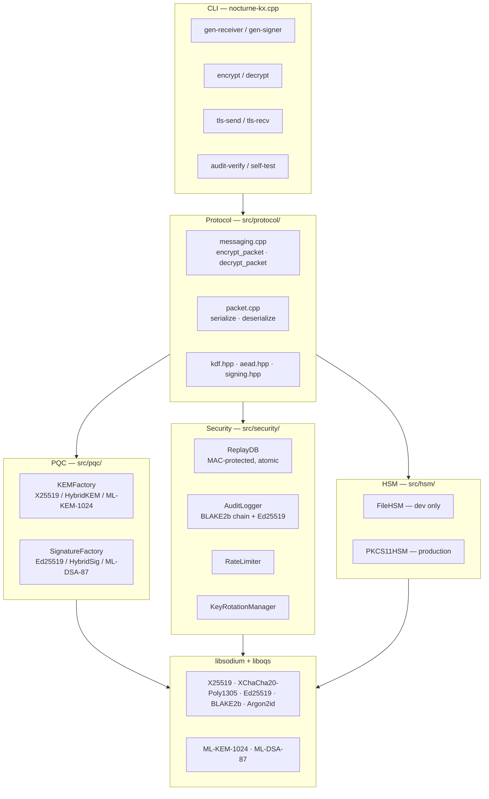
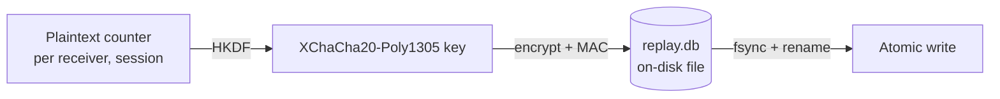

# Architecture

Nocturne-KX is intentionally small at the top and conservative at the
bottom. The CLI is a thin shell over a header-driven library; every
cryptographic operation lives behind a typed interface (`KEMInterface`,
`SignatureScheme`, `HSMInterface`) so the wire format, the audit log,
and the policy layer can be exercised independently.

## Layered view



The only "magic" sits in `src/protocol/messaging.cpp`, which composes the
sub-systems. Everything else is a leaf: `KEMInterface::encapsulate` does
exactly what its name says, returns `Result<T>` on failure, and never
touches global state.

## Module map

| Path                                 | Role                                                                              |
|--------------------------------------|-----------------------------------------------------------------------------------|
| `nocturne-kx.cpp`                    | CLI dispatch; inline `FileHSM` + `PKCS11HSM` adapters; `encrypt`/`decrypt` flow.   |
| `src/core/result.hpp` · `error.hpp`  | `Result<T>` + typed `ErrorCode` — wire/SIEM contract; numbers are stable.          |
| `src/core/byte_span.hpp`             | `BytesView` / `MutableBytesView` (ptr+size collapsed via P6.3).                   |
| `src/protocol/packet.{hpp,cpp}`      | v3 wire format. Compile-time sanity checks via `static_assert`.                   |
| `src/protocol/messaging.{hpp,cpp}`   | `encrypt_packet`, `decrypt_packet`, `*_kem` siblings. Single point of policy.     |
| `src/protocol/{kdf,aead,signing}.hpp`| Tight wrappers over libsodium primitives. All return `Result<T>`.                  |
| `src/pqc/kem/`                       | `KEMInterface` + `KEMFactory` + `HybridKEM` + ML-KEM-1024 wrapper.                  |
| `src/pqc/sig/`                       | `SignatureScheme` + `SignatureFactory` + `HybridSig` + ML-DSA-87 wrapper.          |
| `src/hsm/hsm_interface.hpp`          | Enterprise `nocturne::hsm::HSMInterface`: rotation, audit, policy.                |
| `src/hsm/pkcs11_hsm.hpp`             | Full OASIS PKCS#11 v2.40 `CK_FUNCTION_LIST` (P7.1).                                |
| `src/security/inline/replay_db.hpp`  | Encrypted, MAC-authenticated, atomic on-disk counter store.                       |
| `src/security/audit_logger.hpp`      | Enterprise audit logger; chain head reproducible via `verify_chain()`.            |
| `src/security/key_rotation.hpp`      | Dual-control rotation manager; calls `HSMInterface::generate_key`.                |
| `src/security/siem_connector.hpp`    | Syslog/CEF/LEEF formatters + UDP/TCP/TLS sinks.                                   |
| `src/transport.hpp`                  | Frame protocol — `NEGOTIATE/DATA/ACK/NAK/CLOSE` + `MemoryTransport`.               |
| `src/tcp_tls_transport.hpp`          | OpenSSL TLS 1.3 sibling to `MemoryTransport`; optional mTLS.                       |
| `src/handshake.hpp`                  | SIGMA 3-message handshake; Ed25519 ID + X25519 ephemeral; `TrustStore`.            |
| `src/double_ratchet.hpp`             | Signal-style DR (DH ratchet, chains, skipped keys cap=128, MAX_GAP=10000).         |
| `src/core/side_channel.{hpp,cpp}`    | `secure_zero_memory`, branchless `ct_select`, 100-500µs random delay, `clflush`.   |

## Packet flow — hybrid PQC mode

```mermaid
sequenceDiagram
  participant U as user
  participant S as sender CLI
  participant K as KEMFactory
  participant A as aead.hpp
  participant SIG as SignatureFactory
  participant N as network / file

  U->>S: nocturne-kx encrypt --kem hybrid
  S->>K: encapsulate(receiver_pk)
  K-->>S: (kem_ct 1600 B, shared_secret 32 B)
  S->>S: combine_secrets(NOCTURNE_PROTOCOL_VERSION=4)
  S->>A: encrypt(plaintext, aad, key)
  A-->>S: ciphertext + 16 B tag
  S->>SIG: sign(canonical_bytes, sk)
  SIG-->>S: signature bytes
  S->>N: serialise(packet) — v3 wire format

  Note over S,N: All steps return Result<T>;<br/>any failure is a typed Error<br/>(no exceptions on the hot path)
```

The receiver runs the dual in reverse: `deserialize` first, then `peek`
at the flags byte to pick the KEM mode, then `decapsulate` + `decrypt` +
`verify` — each step short-circuiting on the first typed error.

## Replay database



On-disk format: `[8B version|MSB=encryption-flag][24B nonce][4B ct_len][AEAD ct]`,
with the plaintext version as AAD so an attacker can't downgrade an
encrypted DB to a plain one. Writes go to a `.tmp` file and `rename(2)`
to provide atomicity even across crashes.

## HSM hierarchy

There are **two** `HSMInterface` types and that's not an accident:

- **Inline `HSMInterface`** (global namespace, declared in `src/hsm/inline/`).
  The CLI talks to this. Only the methods the CLI needs:
  `sign`, `get_public_key`, `has_key`, `generate_random`, `is_healthy`.
- **Enterprise `nocturne::hsm::HSMInterface`** (in `src/hsm/`).
  The full surface — `generate_key`, `rotate_key`, `delete_key`,
  `get_audit_trail`, key policy, FIPS reporting.

The inline `PKCS11HSM` adapter is a thin shim that forwards to the
enterprise one via env vars (`PKCS11_LIB`, `NOCTURNE_HSM_PIN`,
`NOCTURNE_HSM_FIPS`). One side handles CLI ergonomics; the other handles
HSM policy.

After P7.1 the enterprise `nocturne::hsm::PKCS11HSM` is validated in
CI against SoftHSM2 — see `.github/workflows/cmake.yml` step
"SoftHSM PKCS#11 integration".

## Threading

- `KEMInterface` and `SignatureScheme` are stateless and thread-safe.
- `FileHSM` and `PKCS11HSM` both use a `mutable std::mutex` to serialise
  state mutations; concurrent `sign()` is safe.
- `ReplayDB` is **not** thread-safe internally — single-writer is
  enforced at the policy layer. Use one `ReplayDB` per process.
- `AuditLogger` is single-writer; multi-writer mode is not supported
  (the chain head is global state).

## libsodium boundary

> Never roll your own crypto. Every cryptographic operation in
> Nocturne-KX is either a libsodium call, a liboqs call, or a
> combination computed by an OASIS/NIST-published combiner.

In practice that means:

- AEAD: `crypto_aead_xchacha20poly1305_ietf_*`
- DH: `crypto_kx_*` and `crypto_scalarmult_*`
- Signatures: `crypto_sign_*` (Ed25519, RFC 8032 deterministic)
- Hash: `crypto_generichash_*` (BLAKE2b)
- KDF: `crypto_kdf_hkdf_sha256_*`
- RNG: `randombytes_buf` (and `OQS_randombytes_*` inside liboqs)
- Memory: `sodium_memzero`, `sodium_memcmp`, `sodium_mlock`

If a code review ever surfaces a hand-rolled cipher, hash, or constant-time
comparison in `src/`, treat it as a bug — open an issue.
