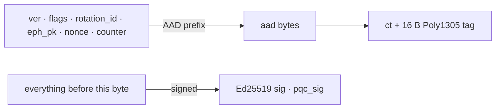

# Wire format v3

A Nocturne-KX packet is a length-prefixed binary frame. The shape is
identical across classical X25519, hybrid X25519 ⊕ ML-KEM-1024, and
pure ML-KEM-1024, the receiver picks the path from the `flags` byte
without re-parsing the rest.

<WireFormat />

## Flag byte

| Bit  | Constant            | Meaning                                          |
|------|---------------------|--------------------------------------------------|
| 0x01 | `FLAG_HAS_SIG`      | Detached Ed25519 signature at the tail.          |
| 0x02 | `FLAG_HAS_RATCHET`  | DH-ratchet `ratchet_pk` block present.           |
| 0x04 | `FLAG_HAS_PQC_KEM`  | `eph_pk` is zeroed; KEM block present after head.|
| 0x08 | `FLAG_HAS_PQC_SIG`  | Variable-length PQ signature at the tail.        |

Bits are proven distinct single bits at compile time
(`std::has_single_bit` + OR-sum) in `src/protocol/packet.hpp`. Adding a
future flag is a one-line change there; the static_assert refuses to
build until the value lands in the right slot.

## Canonical byte order

Length fields are little-endian unsigned 32-bit integers. Public keys,
nonces, ciphertexts, and signatures are written in their algorithm's
natural byte order (libsodium and liboqs each define this, and we
never reorder bytes inside a primitive).

## Authenticated boundaries

- **AEAD authenticates:** the canonical-bytes header prefix, the
  `aad` field, and the ciphertext itself. Poly1305 tag is 16 B,
  appended inline to the ciphertext per
  `crypto_aead_xchacha20poly1305_ietf_encrypt`.
- **Signature(s) authenticate:** every byte that precedes the
  signature block. Reordering the signature behind another field
  would let an attacker swap the AAD; the layout pins it.

## Maximum sizes

| Field         | Cap                                | Source                              |
|---------------|------------------------------------|-------------------------------------|
| `MAX_PACKET_SIZE`   | 16 MiB                       | Frame-protocol DoS guard            |
| `MAX_PQC_CT_SIZE`   | 2 KiB                        | `static_assert` against ML-KEM-1024 |
| `MAX_PQC_SIG_SIZE`  | 8 KiB                        | `static_assert` against ML-DSA-87   |
| `aad_len` + `ct_len`| `u32`                        | Wire field                          |

Oversized fields are rejected at `deserialize` time with
`ErrorCode::PacketFieldOversized`, see `src/core/error.hpp` for the
SIEM-stable error number.

## Version policy

`NOCTURNE_PROTOCOL_VERSION` (currently 4) is **distinct** from the
packet's `ver` byte (currently 3). The protocol version is the value
bound into the KDF combiner for hybrid KEM secret derivation; the
packet version is the on-the-wire format tag. They evolve on different
axes:

- A new hybrid combiner bumps `NOCTURNE_PROTOCOL_VERSION` without
  touching the wire format.
- A new wire field bumps `ver` without changing the combiner.

Conflating these two surfaces silently (sender and receiver derive
different secrets) was the bug fixed by commit `9b5c00b`, see
[lessons learned](https://github.com/Bufffer/nocturne-kx/blob/main/CHANGELOG.md).
